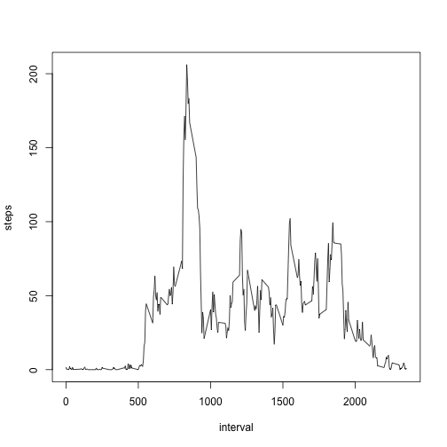

## Loading and preprocessing the data
Load the csv file into a data frame called df.

```r
df <- read.csv("activity.csv", colClasses = c("numeric", "Date", "numeric"))
```

## What is mean total number of steps taken per day?
Create a new data frame that contains one entry per day with the total steps for the day.  Plot a histogram and check the mean/median.

```r
daily <- aggregate(steps ~ date, df, sum)
hist(daily$steps)
```

 

```r
mean(daily$steps)
```

```
## [1] 10766.19
```

```r
median(daily$steps)
```

```
## [1] 10765
```

## What is the average daily activity pattern?
Create a data frame called intervalAvg that contains the mean of the steps for that interval across all the days.  Plot this data and also find the interval with the max steps.

```r
intervalAvg <- aggregate(steps ~ interval, df, mean)
with(intervalAvg, plot(interval, steps, type="l"))
```

 

```r
intervalAvg[intervalAvg$steps == max(intervalAvg$steps),]
```

```
##     interval    steps
## 104      835 206.1698
```

## Imputing missing values
How many missing values are in the data set?

```r
nrow(df[is.na(df$steps),])
```

```
## [1] 2304
```

Duplicate the original data, then fill in any missing values with the average steps for the interval.

```r
df.filled <- df
i <- rep(intervalAvg$steps,61)
df.filled$steps <- ifelse(is.na(df$steps), i, df$steps)
```
Double check to see if there are any missing values.

```r
nrow(df.filled[is.na(df.filled$steps),])
```

```
## [1] 0
```
Using the filled data set perform the same initial analysis.

```r
daily.filled <- aggregate(steps ~ date, df.filled, sum)
hist(daily.filled$steps)
```

 

```r
mean(daily.filled$steps)
```

```
## [1] 10766.19
```

```r
median(daily.filled$steps)
```

```
## [1] 10766.19
```

Because all of the missing values belong to complete days of missing data, imputing missing values using average values creates days that are average.  This causes the distribution of daily values to be more concentrated around the mean.  Comparing the before and after histograms shows that the shape of the histograms are similar except that the cell containing the median is higher.  The mean and median are basically the same as before, which is what we would expect since the filled in days are "average".

## Are there differences in activity patterns between weekdays and weekends?

Here we use the filled in data set to compare weekends vs weekdays.  First create a new factor variable in the data frame.

```r
period <- ifelse(weekdays(df$date,abbreviate = T) %in% c("Sat","Sun"), "weekend", "weekday")
df.filled <- cbind(df.filled,period)
```

Now calculate the average steps per interval for each period of weekend or weekday.

```r
WE <- aggregate(steps ~ interval, df.filled[df.filled$period == "weekend",], mean)
WD <- aggregate(steps ~ interval, df.filled[df.filled$period == "weekday",], mean)
```

Using the computed averages create a 2 panel plot to compare the two periods.

```r
WE <- cbind(WE, period=rep("weekend",288))
WD <- cbind(WD, period=rep("weekday",288))
library(lattice)
xyplot(steps ~ interval | period, data = rbind(WE,WD), type="l", layout = c(1,2))
```

 

The graphs indicate that the user probably sleeps in on weekends and is more physically active on weekends.
  
  
  
  
